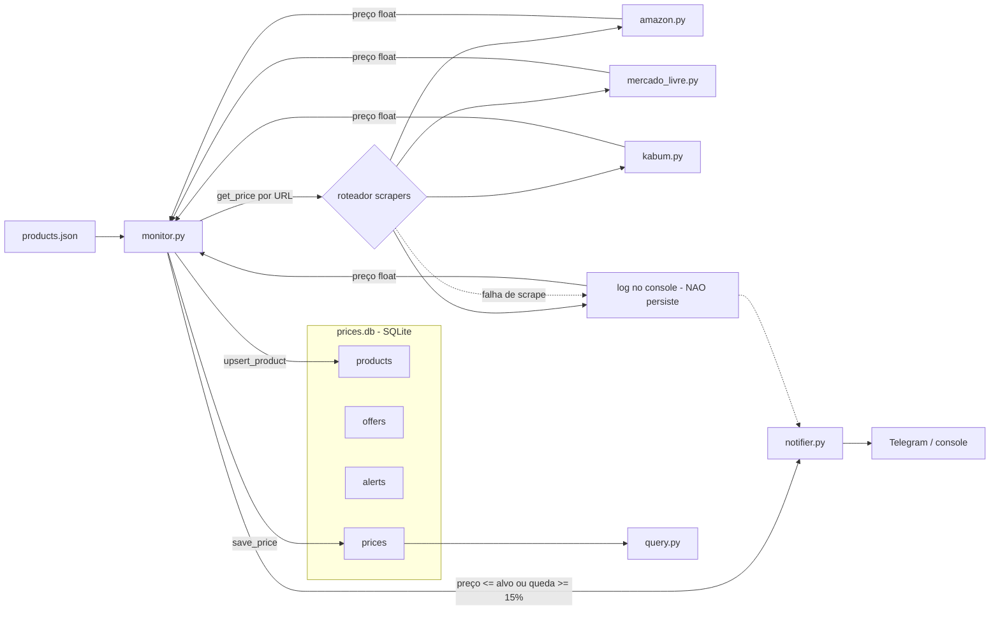

# price-agent

Agente pessoal de compras para monitorar produtos desejados, pesquisar precos em fontes curadas e avisar quando aparecer uma oportunidade real de compra.

O projeto esta evoluindo de um monitor de URLs especificas para um sistema mais amplo: voce cadastra um produto, define criterios de busca e preco-alvo, e o agente procura ofertas em fontes como marketplaces e comparadores de preco. Os resultados sao registrados em um local central; o destino final planejado e um aplicativo proprio com painel e notificacao push.

## Objetivo

Transformar buscas manuais de preco em um fluxo recorrente:

1. Cadastrar produtos desejados.
2. Buscar ofertas em fontes confiaveis.
3. Comparar preco, loja, link e aderencia ao produto.
4. Identificar oportunidades abaixo do preco-alvo ou com bom score.
5. Registrar resultados em um painel central.
6. Enviar alerta quando houver uma oportunidade relevante.

Exemplo de entrada:

```text
Produto: Geladeira Electrolux Inverter modelo XYZ
Faixa de alerta: R$ 3.500 a R$ 4.200
Palavras obrigatorias: Electrolux, Inverter, XYZ
Palavras proibidas: usado, recondicionado
Prioridade: alta
```

## Estado atual

Sistema autonomo rodando desde 06/08/2026:

- historico em Postgres gerenciado (Neon), alimentado todo dia pelo cron do GitHub Actions (9h BRT);
- scrapers por loja: HTML via Playwright (Amazon, Mercado Livre, Kabum) e API VTEX via requests
  (Electrolux — sem browser, imune a anti-bot);
- busca multi-loja por `busca.py`: 8 lojas VTEX, ordena por preco, filtro `--bloquear` por pesquisa;
- alertas por Telegram (preco <= alvo ou queda >= 15%) com fallback para console;
- analise do historico em `analise_precos.ipynb` (pandas: menor preco do dia por produto);
- consulta rapida por `query.py`.

Proxima evolucao (ver [PROJECT_SCOPE.md](PROJECT_SCOPE.md)): painel proprio de acompanhamento e o
pipeline busca -> cadastro -> monitoramento (Search Agent v2).

## Resultados

- Cron diario capturando precos sem intervencao humana desde a Fase B (com a maquina do dev desligada).
- Alerta de preco-alvo validado ponta a ponta no Telegram.
- Aprendizados documentados no PROJECT_SCOPE: Mercado Livre bloqueia browser automatizado; Amazon
  bloqueia IP de datacenter de forma intermitente; API oficial do ML exige OAuth. A resposta de
  arquitetura foi a fonte via API VTEX — estruturada, rapida (~1s vs ~20s de browser) e estavel.

## Arquitetura planejada

Os "agentes" comecam como modulos simples e podem evoluir para orquestracao mais inteligente depois:

| Modulo | Responsabilidade |
|--------|------------------|
| Product Agent | Normalizar produto, marca, modelo, palavras obrigatorias e proibidas |
| Search Agent | Buscar candidatos em fontes curadas como Zoom, Buscape, Amazon, Mercado Livre e outras |
| Price Agent | Extrair preco, loja, frete quando possivel, link e disponibilidade |
| Opportunity Agent | Calcular score e decidir se existe oportunidade |
| Report Agent | Registrar achados no painel e gerar resumo |
| Alert Agent | Enviar alerta por Telegram e, no futuro, push pelo app proprio |

## Fases

### Fase 1: MVP funcional

- Cadastrar produto, preco-alvo e palavras-chave.
- Buscar em 2 ou 3 fontes iniciais.
- Extrair titulo, preco, loja, link e fonte.
- Filtrar falsos positivos basicos.
- Gerar score simples.
- Salvar resultado em SQLite.
- Alertar quando o preco estiver dentro da faixa configurada ou cair 15% em relacao ao menor preco anterior.

### Fase 2: Painel de acompanhamento

- Comecar com relatorio local; evoluir para aplicativo proprio.
- Registrar produtos monitorados.
- Registrar ofertas encontradas.
- Marcar status: nova, boa, ignorada, comprada.
- Manter ultima verificacao e melhor preco.

### Fase 3: Automacao recorrente

- Rodar em agenda diaria ou por intervalo.
- Evitar alertas duplicados.
- Atualizar historico de preco.
- Gerar resumo periodico no painel.

### Fase 4: Inteligencia de compra

- Melhorar correspondencia entre busca e produto real.
- Comparar variacoes de modelo.
- Considerar reputacao da loja e frete.
- Aprender com ofertas ignoradas.
- Responder perguntas sobre historico e melhores oportunidades.

## Estrutura atual

```text
price-agent/
|-- .github/workflows/monitor.yml  # cron diario no GitHub Actions
|-- products.json      # produtos monitorados atualmente
|-- monitor.py         # agente principal: captura, grava e decide alertas
|-- busca.py           # busca multi-loja via API VTEX (POC do Search Agent)
|-- notifier.py        # Telegram / console (loga recusa da API)
|-- database.py        # Postgres (Neon) via psycopg
|-- analise_precos.ipynb  # analise do historico com pandas
|-- query.py           # consulta menor preco
|-- setup_db.py        # inicializa o banco e cadastra produtos
|-- inspect_db.py      # mostra produtos, ofertas e alertas
|-- record_offer.py    # registra oferta manual para teste/MVP
|-- scrapers/
|   |-- amazon.py      # HTML via Playwright
|   |-- mercado_livre.py
|   |-- kabum.py
|   |-- electrolux.py  # API VTEX via requests (sem browser)
|   |-- browser.py
|   `-- page.py
|-- PROJECT_SCOPE.md   # escopo e roadmap do produto
|-- SETUP.md
`-- requirements.txt
```

## Arquitetura atual


Gaps e decisoes pendentes: ver [Estado atual](PROJECT_SCOPE.md#estado-atual) no PROJECT_SCOPE.

## Setup

Guia completo: [SETUP.md](SETUP.md)

```powershell
cd price-agent
python -m venv .venv
.\.venv\Scripts\Activate.ps1
pip install -r requirements.txt
playwright install chromium
copy .env.example .env
python setup_db.py
```

Scrapers rodam no Chromium empacotado do Playwright (instalado via `playwright install chromium`).

## Produto monitorado

Formato atual do `products.json`:

```json
{
  "name": "Geladeira Frost Free",
  "brand": "Brastemp",
  "model": "bro85mb",
  "target_price_range": {
    "min": 3500,
    "max": 4200
  },
  "required_keywords": ["geladeira", "brastemp", "frost"],
  "blocked_keywords": ["usado", "recondicionado"],
  "priority": "alta",
  "sources": ["zoom", "buscape", "jacotei", "mercado_livre", "amazon", "casas_bahia", "magalu", "kabum"],
  "status": "active"
}
```

## Uso atual

Inicializar ou atualizar produtos no SQLite:

```powershell
python setup_db.py
```

Inspecionar o banco:

```powershell
python inspect_db.py
```

Registrar uma oferta manualmente:

```powershell
python record_offer.py "Geladeira Frost Free" --title "Geladeira Brastemp Frost Free BRO85MB" --price 3999 --source manual --store "Loja Teste" --url "https://example.com/oferta"
```

Execucao unica:

```powershell
python monitor.py
```

Com agendamento embutido:

```powershell
python monitor.py --schedule
```

Consulta historico:

```powershell
python query.py "Geladeira Frost Free" --days 30
```

Busca multi-loja (candidatos ordenados por preco, salvos em `ultima_busca.json`):

```powershell
python busca.py "tablet" --limite 5 --bloquear "reembalado,infantil"
```

## Proximos passos imediatos

- Definir o formato novo de `products.json`.
- Escolher as primeiras fontes de busca.
- Criar modelo de dados para ofertas encontradas.
- Desenhar o painel de acompanhamento (app proprio).
- Separar os modulos internos por responsabilidade.
